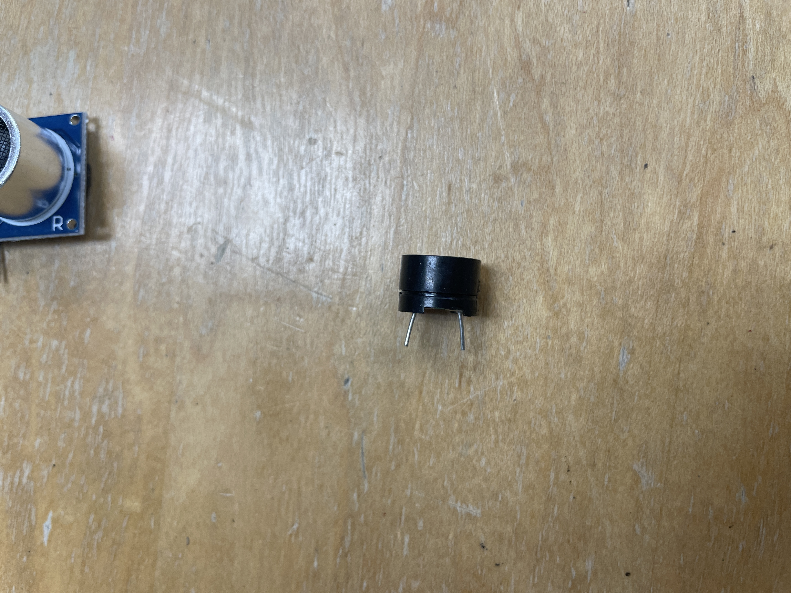

# Lab 3: Ramp Circuit

# Overview and Motivation
Welcome to Lab 4 of CS281: Introduction to Computer Systems!  
This lab we will get deeper into the sensors and actuators. Sensors are devices that gather information from the environment, 
and actuators use that information to physically change the environment. 
We'll explore how to connect these components to an Arduino.

 

# Objectives of the Lab
1. Understand the basic operation of various sensors and actuators.
2. Learn how to connect sensors and actuators to an Arduino.
3. Design and build a project using sensors and actuators, document your process, and showcase it through a video.
   
# Materials
- PB-503 Breadboard prototyping station (integrated device with a number of electrical components like switches)
- Arduino Uno
- Wires
- Sensors (buzzer, ultrasonic sensor, photoresistor)
- Actuators (buzzer, servo motor)
- Multimeter 
- Resistors
- LED 
- Computer with Arduino IDE installed

# Overview: 

1. Buzzer: Learn how to control a buzzer using the Arduino to produce different tones.
2. Ultrasonic Sensor: Discover how to use an ultrasonic sensor to measure distances to objects and translate them into readings on the Arduino.
3. Distance Detector: Design a handheld device with an ultrasonic sensor that create tones based on the distance to objects (low pitch for close, high pitch for far).

# Building the Lab: 
## Buzzer

### 0 About
 

In this section, we will build a buzzer that generating sound.  
We will control the buzzer with a wave of pulses that we will generate.  

#### What we need
- Arduino Uno or compatible board
- Breadboard
- Wires
- buzzer
- Computer with Arduino IDE installed

 
### 1. Project Step

- We will connect 5 voltage to + sign labeled pin in the buzzer and connect ground to the - sign labeled in the buzzer.
- "+" and "-" sign represent the metallic membrane inside the buzzer
#### Note: When a 5 voltage is applied to the input pids, the metallic membrane enters an excited state and without the voltage applied, it is contracted. This rotation create audible click
- By changing the voltage very frequently,  we can generate a sound 

### 2. Testing

## 1. Ultrasonic Sensor
Before we start with the design challenege, it is important to understand each individual device we will use before we combine them. First we will understand the ultrasonic sensor (aka sonar detector). This device records distance by sending out an ultrasonic ping and measures the  time it takes for the ping to return.
=======

## 0 About
 

### Materials
- Arduino Uno or compatible board
- Breadboard
- Wires
- buzzer
- Computer with Arduino IDE installed

 
## 1. Project Step

## 2. Testing

# Testing Number Display

# Conclusion

 
 

https://github.com/mlcourses/lab-4-blog-post-AdvancedUno/assets/108073642/e0faec69-4cfa-4f30-b43f-e10c971b1be8

https://github.com/mlcourses/lab-4-blog-post-AdvancedUno/assets/108073642/007ee576-73ff-40fd-a734-1684e9dfb078

https://github.com/mlcourses/lab-4-blog-post-AdvancedUno/assets/108073642/108fc71d-adbf-4765-8f80-cd9a789e3e1e

https://github.com/mlcourses/lab-4-blog-post-AdvancedUno/assets/108073642/ce3c92ad-c736-440a-9fc8-727ebc676e04

https://github.com/mlcourses/lab-4-blog-post-AdvancedUno/assets/108073642/e4105621-6bd2-4ea0-8928-d857890a7cf3

https://github.com/mlcourses/lab-4-blog-post-AdvancedUno/assets/108073642/56b10f36-0d01-4c50-a025-fa821a7e2ca8

https://github.com/mlcourses/lab-4-blog-post-AdvancedUno/assets/108073642/b6ee0366-96d4-41c3-9aa7-7172dc3394a9

https://github.com/mlcourses/lab-4-blog-post-AdvancedUno/assets/108073642/0c54f736-18b1-4ddd-8571-a6a27108c60c

https://github.com/mlcourses/lab-4-blog-post-AdvancedUno/assets/108073642/dca5c6ae-a2e8-452c-8739-c57b50750900

https://github.com/mlcourses/lab-4-blog-post-AdvancedUno/assets/108073642/4e1ca5e8-150b-494a-a431-3484171ecea2

https://github.com/mlcourses/lab-4-blog-post-AdvancedUno/assets/108073642/69e6a3d6-d90c-482d-a196-a021a301e326

https://github.com/mlcourses/lab-4-blog-post-AdvancedUno/assets/108073642/38c2daf2-271b-4b9b-8fb1-391f7bd3b5e4

https://github.com/mlcourses/lab-4-blog-post-AdvancedUno/assets/108073642/79fcb32f-9436-4bf5-94d0-eb4efa642f6e

https://github.com/mlcourses/lab-4-blog-post-AdvancedUno/assets/108073642/5a3f1c5f-7601-45d3-b295-04f8aa4a7dd1

https://github.com/mlcourses/lab-4-blog-post-AdvancedUno/assets/108073642/13135ea7-bc68-4bf5-b28d-5b0b9f485ead

https://github.com/mlcourses/lab-4-blog-post-AdvancedUno/assets/108073642/39cad9a3-9be1-40ce-8116-cb2879642d2b

